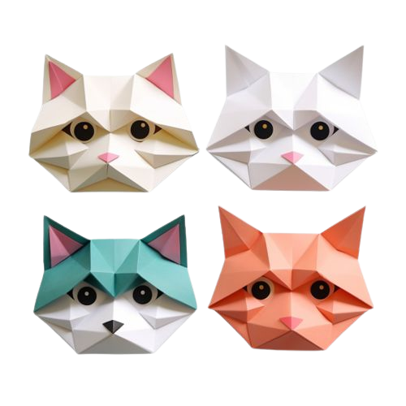

# Cat browser

The Cat browser allows you to see cute and cuddly cats, organized by breed.
Click through a cat image to learn even more about the breed!

## Technical aspect

The technologies and packages used in this project include:

- React
- Typescript
- Fetch API
- Context API
- styled-components
- eslint
- react-router-dom

All the information about the cats as well as the images come from:

- https://thecatapi.com/

---

Jordan Degerman 2023
